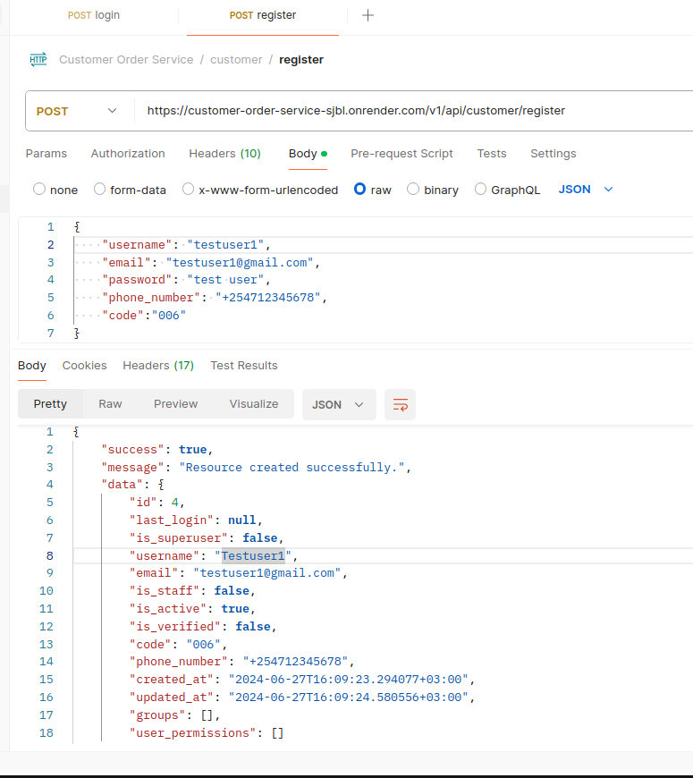
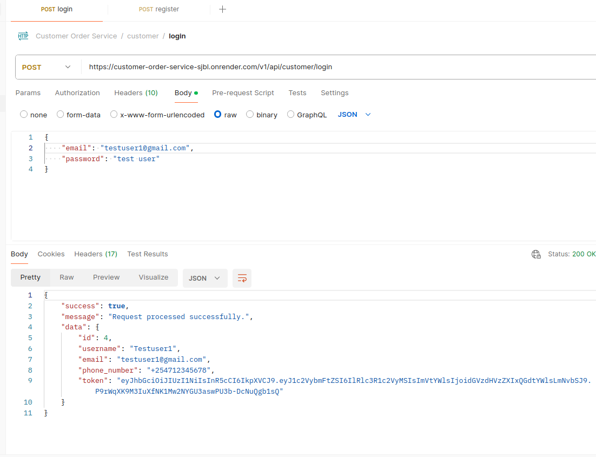
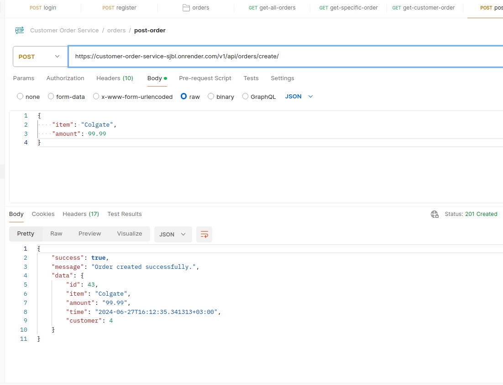
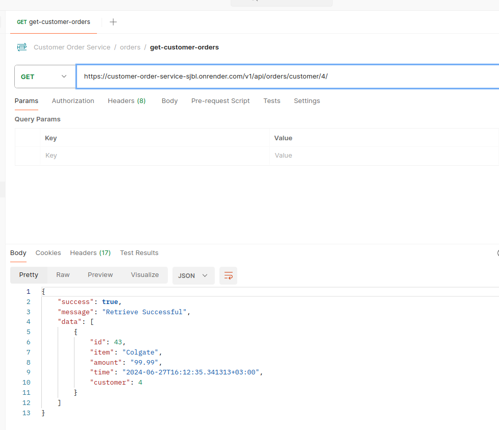

# customer-order-service
# Title

> > CUSTOMER ORDER SERVICE

# Description

> > Our project focuses on developing a Django-based backend service to manage customer and order data efficiently. It aims to address the common challenges businesses face in organizing and processing customer interactions and orders.

# 🛠 Technologies Used

> > - Python: Language used for backend development.
> > - Django: Framework for building web applications.
> > - Django REST Framework: Toolkit for building RESTful APIs.
> > - PostgreSQL: Database management system used.
> > - OAuth2: Authentication framework used for securing APIs.
> > - Africa's Talking SMS Gateway: Used for sending SMS notifications.

# Features

> > - Sign Up
> > - Login
> > - Post Order
> > - Receive sms notification ones order has been done

# Setup requirements

- git (https://git-scm.com/)
- Web browser of your choice
- Github (https://github.com/)
- Python (https://www.python.org/)
- Django (https://www.djangoproject.com/)

# Installation

1. Clone the repository:

   > > [@Project Repository](https://github.com/Zac-Mwangi/customer-order-service)

2. Set up the virtual environment (optional but recommended):
    
    > > python -m venv env
    > > source env/bin/activate 

3. Install dependencies:

    > > pip install -r requirements.txt

4. Database setup:

    > > Ensure PostgreSQL is installed and running.
    > > Configure the database settings in settings.py.

5. Apply migrations:

   > > python manage.py migrate

6. Run the development server:

   > > python manage.py runserver

7. Access the API:

    > > Open your web browser and go to http://localhost:8000/ or as per your setup.
    > > or use live link [@Live Link](https://customer-order-service-sjbl.onrender.com/)

# GitHub Code

> > [@Project Repo](https://github.com/Zac-Mwangi/my-job-website)

# Live Link

> > [@Live Link](https://customer-order-service-sjbl.onrender.com/)

# API Endpoints

>> REGISTER

>> LOGIN

>> CREATE ORDER 

>> GET CUSTOMER ORDERS 

# Authors

> > - [@Zac-Mwangi](https://github.com/Zac-Mwangi/)

# Feedback

> > If you have any feedback, please reach out to us at [@Email](zackmwangi998@gmail.com)

# Tech Stack

> > **LANGUAGE:** Python

> > **FRAMEWORK:** Django Rest Framework
> 
> > **API:** REST API

# License

> > [MIT](https://choosealicense.com/licenses/mit/)
